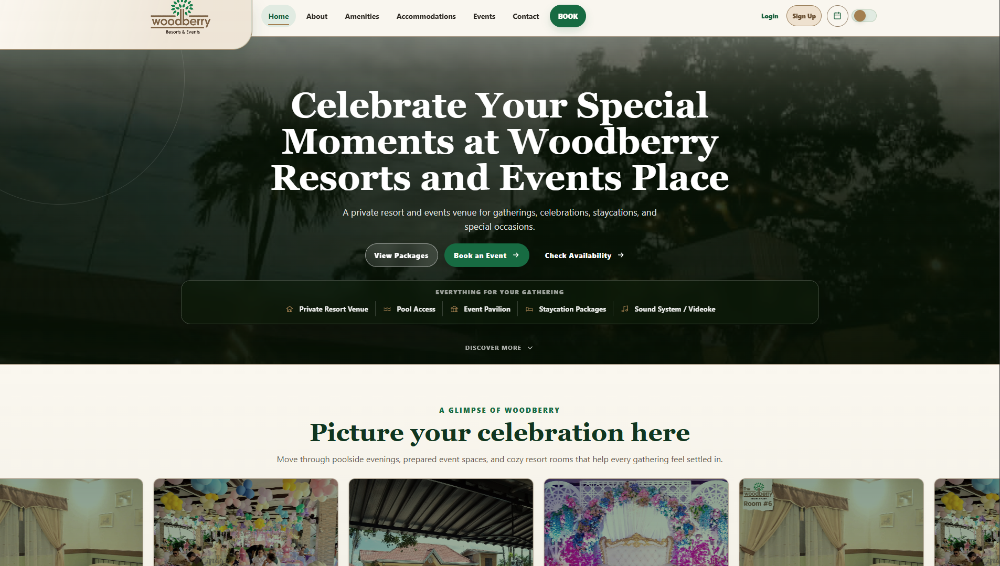
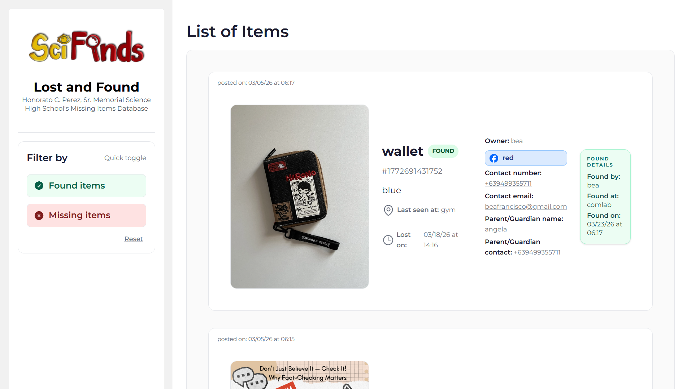

# Ralph Yu — Developer Portfolio

A professional single-page portfolio website for Ralph Jerome T. Yu, built to present developer skills, selected projects, contact information, and a downloadable resume for recruiters, clients, and professional networking.

## Live Portfolio

[https://ralph-yu-portfolio.vercel.app/](https://ralph-yu-portfolio.vercel.app/)

## Technology Stack

- Astro
- TypeScript
- Tailwind CSS
- Vercel

## Main Sections

- Home
- About
- Skills
- Projects
- Contact

## Featured Projects

### Woodberry Resort and Events Booking and Management System

[View project](https://capstone-clone-tan.vercel.app/)



### Lost and Found Website for Local Schools

[View project](https://lost-and-found-website-azure.vercel.app/)



## Key Features

- Responsive design
- Light/dark mode
- Accessible navigation
- Downloadable resume
- Project preview images

## Local Development

Install dependencies:

```bash
npm install
```

Start the development server:

```bash
npm run dev
```

Build the site for production:

```bash
npm run build
```

Preview the production build locally:

```bash
npm run preview
```

Run Astro commands directly:

```bash
npm run astro
```

## Project Structure

```text
.
├── public/
│   ├── projects/
│   │   ├── lost-and-found-preview.png
│   │   └── woodberry-preview.png
│   └── ralph-yu-resume.pdf
├── src/
│   ├── components/
│   ├── data/
│   ├── layouts/
│   └── pages/
├── package.json
└── README.md
```
